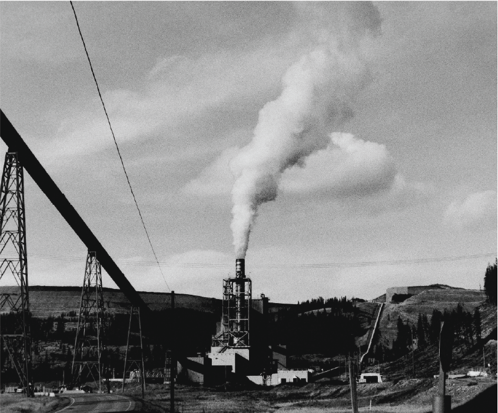

# Research and Other Work
---

With the rate of climate change likely to outpace many species' ability to respond to newer and more extreme environmental conditions, we need to find ways to help them adapt more rapidly. Understanding the mechanisms that may have led to the evolution of key innovations during past periods of rapid environmental change is crucial if we hope to save at-risk species today.

My current and future research aims are to explore the drivers of adaptation in both modern and ancient organisms. These drivers include both macro and microevolutionary processes, with a special interest in the role development plays in adaptation.

Previously during my master's degree, I investigated the evolution of the conodont genus *Sweetognathus*. During my undergraduate degree, I wrote historical geologic case studies for undergraduate classrooms, and during my undergraduate thesis, I investigated how collection techniques may have introduced a sampling bias in Eocene fossil collections.

## Elk Valley Coal Mining
---

The Elk Valley Coal mines represent one of the world’s largest ongoing selenium contamination issues to date. In the heart of the Elk Valley, Teck Resources Limited owns and operates four major mountaintop removal coal mines with an annual production capacity of 26 to 27 million metric tons of steelmaking coal (Teck DPD 2021, 2-1). Selenium and other water-borne contaminants travel down the Fording River into watersheds that comprise much of the Kootenay region and across transboundary waterways. Despite the recognition of an ongoing contamination crisis, Teck Resources Limited continues to release selenium concentrations well above water quality guidelines into the Fording River and its tributaries. The continued release of selenium and other contaminants into our rivers now jeopardizes drinking water sources in the Elk Valley, westslope cutthroat trout and their habitat in the Fording River, and countless other species in British Colombia, Montana, and Idaho.

<button name="button" href="/Wyatt-Petryshen/elkvalley.html">Read More</button>

<body>
  

  
  

</body>

Image of a mountaintop removal coal mine, located in the Elk Valley, British Columbia, Canada. Photo by Eddie Petryshen.

<body>
  

  
  

</body>

Image of the coal elevators located in the Elk Valley, British Columbia, Canada. Photo by Gryphen Goss.

## Conodont Research
---
<body>
  

  
  

</body>

A close up image of a denticle located on the carina of a conodont P1 element. Each denticle would have been the functional surface of the element, used in processing food material while the animal feed.

### What is a conodont?

---
Conodont's were early marine vertebrates that were the first to developed a biomineralized phosphatic dental skeleton composed of fluorapatite, much like the teeth in our mouth. Though the composition of their dental elements are similar to ours, conodont dental tissues and vertebrate enamel represent an extraordinary case of convergent evolution (Murdock et al. 2013). Morphologically, conodonts would have looked very similar to modern-day lamprey's, both having long slender bodies and a complex feeding apparatus, though they were likely not parasitic. Conodonts went extinct at the end-Triassic, some 200 million years ago.

### Why study conodonts?

---
Apart from their importance in biostratigraphy, conodonts provide us with a model organism to study long-term evolutionary change in a marine environment. Though only their dental elements are preserved, they are numerous in the rock record and can be easily retrieved from carbonate rocks. In most cases, conodont dental morphologies rapidly evolved to changing environmental conditions, meaning we have a detailed record of changes in diversity linked to episodes of global climate change!

<body>
  

  
  

</body>

The material properties of an organisms hard-tissues will be adapted to the environment it lives in. This is a histological section through the P1 element of a conodont from the genus *Sweetognathus whitei*. Thin growth layers, called lamellar tissue are seen composing the majority of the element. Near the upper surface, patches of white matter is also seen. Is this white matter adapted to deal with certain mechanical stresses related to the animals feeding habit? More research to come!
