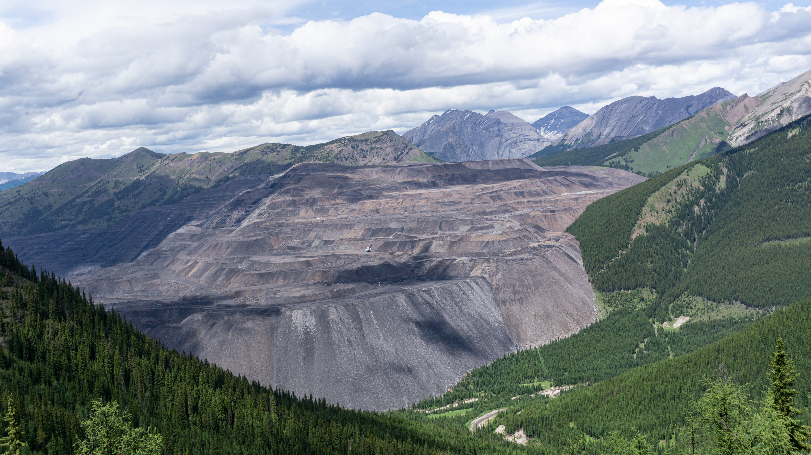
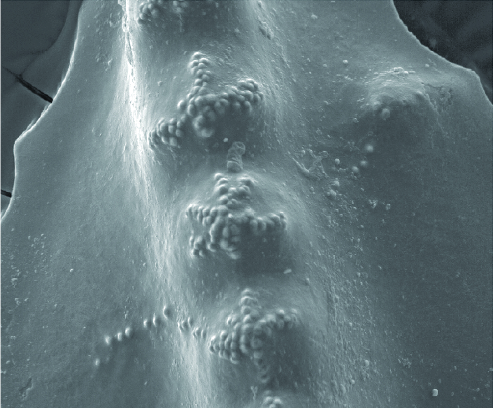
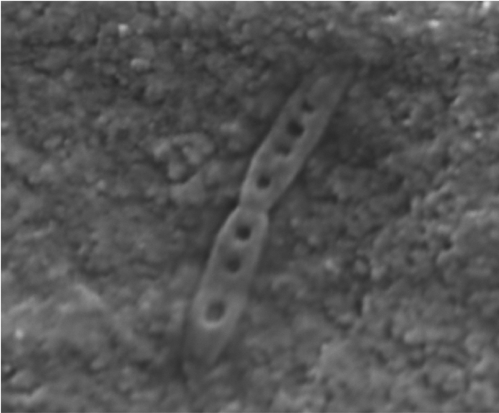
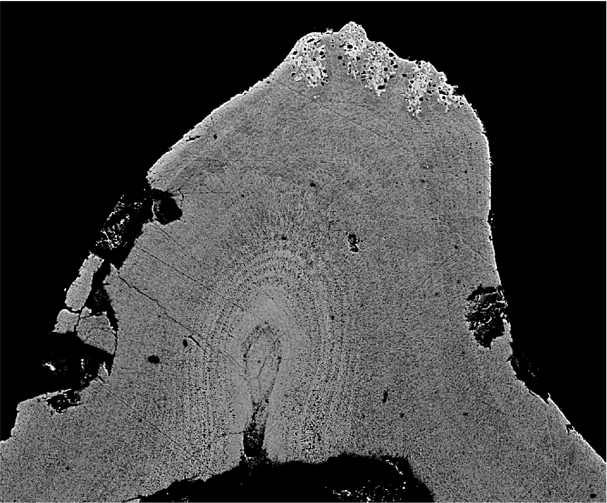

# Research

My research aims at exploring the drivers of diversity in both modern and ancient marine ecosystems.

During the duration of my Master's degree I investigated the evolution of the conodont genus *Sweetognathus*.

My current research is exploring the ultrastructure in conodont P1 elements related to dietary constraints, as well as looking at overall controls on *Sweetognathus* diversity during the Permian.

Additionally, some of my previous research was writing historical geologic case studies for use in undergraduate classrooms, and dental taphonomy in mammals from Saskatchewan.

Future research hopes to explore the role developmental plasticity plays in community assemblage and diversity patterns, and the predicting of ecosystem health based on ecosystem interactions.

# Images Explained

## Image 1
---
<body>
  

  
  

</body>

## Image 2
---

## Image 3
---

## Image 4
---

